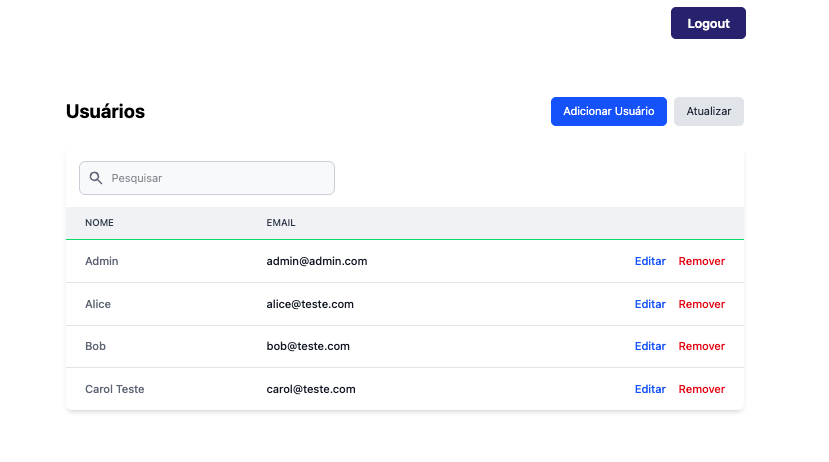

# Fullstack User CRUD

Este é o backend da aplicação de CRUD de usuários, desenvolvido com NestJS, PostgreSQL e Redis.

## Funcionamento da Aplicação

### Tela de Login


### Tela Principal (Home)



## Requisitos

- Node.js (v16 ou superior)
- PostgreSQL
- Redis

## Usuário de Teste para Login

- **Email:** admin@admin.com
- **Senha:** 123456

Outros usuários de teste criados no banco:
- alice@teste.com / 123456
- bob@teste.com / 123456
- carol@teste.com / 123456

## Subindo o Banco de Dados e Redis com Docker

```bash
# PostgreSQL
# (cria o banco fullstack_crud automaticamente se rodar o init.sql depois)
docker run --name postgres-crud -e POSTGRES_PASSWORD=postgres -e POSTGRES_DB=fullstack_crud -p 5432:5432 -d postgres:16

# Redis
docker run --name redis-crud -p 6379:6379 -d redis:latest
```

## Instalação e Execução do Backend

```bash
cd backend
npm install
cp .env.example .env
# Edite o .env se necessário (usuário/senha do banco)
# Execute o script SQL para criar as tabelas e usuários de teste:
psql -U postgres -d fullstack_crud -f src/database/init.sql
npm run start:dev
```

## Instalação e Execução do Frontend

```bash
cd frontend
npm install
npm run dev
```

Acesse o frontend em: [http://localhost:3001](http://localhost:3001) (ou porta configurada)

## Funcionalidades
- CRUD de usuários
- Cache com Redis
- Autenticação JWT
- Testes automatizados
- Tela de login protegida
- Botão de logout

## Endpoints Backend
- `POST /users` - Criar usuário
- `GET /users` - Listar todos os usuários
- `GET /users/:id` - Buscar um usuário específico
- `PATCH /users/:id` - Atualizar um usuário
- `DELETE /users/:id` - Remover um usuário
- `POST /auth/login` - Login (JWT)

## Observações
- O frontend só permite acesso à listagem/cadastro/edição se estiver autenticado.
- O botão de logout está disponível no topo direito da home.
- Para testar, use o usuário admin@admin.com / 123456 ou crie novos usuários.

## Estrutura do Projeto

```
fullstack-user-crud/
├── backend/
│   ├── src/
│   │   ├── users/
│   │   ├── auth/
│   │   ├── database/init.sql
│   │   ├── app.module.ts
│   │   └── main.ts
│   ├── .env.example
│   └── README.md
├── frontend/
│   ├── src/
│   │   ├── pages/
│   │   ├── hooks/
│   │   ├── services/
│   │   └── styles/globals.css
│   ├── tailwind.config.js
│   ├── postcss.config.js
│   └── README.md
```

## Tecnologias Utilizadas
- NestJS
- TypeORM
- PostgreSQL
- Redis (Cache)
- Jest (Testes)
- Class Validator
- TypeScript
- Next.js
- React Query
- Tailwind CSS
